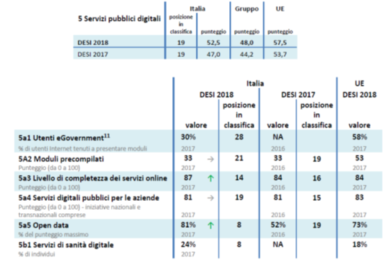

.. _h7a711d60336532295a73645f793c5215:

3. Trasformazione digitale della PA
###################################

.. _h1d185b642d77d4345341f4b73267856:

3.1 Piano triennale e governance dell’innovazione
*************************************************

La passata legislatura ha coinciso con l’avvio dell’\ |STYLE0|\ , ovvero l'insieme di azioni e norme per lo sviluppo delle tecnologie, dell'innovazione e dell'economia digitale in Italia, nel quadro della strategia Europa 2014-2020 per la crescita intelligente, sostenibile e inclusiva\ [#F1]_\ .

Nella cornice delle indicazioni fornite a livello di UE, nel 2015 l’Italia si è dotata di una propria strategia nazionale, la \ |LINK1|\ , sulla base del quale nel 2016 è stato poi definito un nuovo \ |STYLE1|\ .

Nel 2017 è stato redatto il \ |LINK2|\ , documento di indirizzo strategico e pianificazione economica per l’attuazione del modello strategico e dei progetti abilitanti per la trasformazione digitale della PA.

La pubblicazione del Piano rappresenta senza ombra di dubbio uno degli elementi più significativi della passata legislatura, sia per gli elementi di innovatività introdotti, sia per la visione olistica che caratterizza l’impianto complessivo del documento, legando tra loro le diverse componenti. Infatti, negli anni passati il principale limite alla digitalizzazione della PA italiana è stato rappresentato dalla frammentazione di infrastrutture e servizi sviluppati dalle singole PA nel quadro della loro autonomia, e dal conseguente frazionamento della spesa per l’ICT.

Con il Piano si definisce per la prima volta un modello di riferimento coerente con indicazioni puntuali in termini di azioni, risorse e tempi di attuazione. Per non disperdere le opportunità fornite dal Piano triennale, nei prossimi anni sarà fondamentale prestare particolare ad alcuni aspetti di particolare rilevanza strategica.

In questo paragrafo vengono trattati alcuni punti relativi alla governance della trasformazione digitale della PA, mentre in quelli successivi vengono affrontate in maniera puntuale alcune possibili azioni relative alle principali componenti strategiche del Piano triennale. 

.. _he6c4d56f65233c3b187d12424e1d67:

Strutture di governance
=======================

.. _h3b285e26f79526c743d123c77437f3d:

Il ruolo dell’Agenzia per l’Italia Digitale
-------------------------------------------

La normativa attribuisce ad AgID il coordinamento delle attività di progettazione e monitoraggio dell’evoluzione strategica del sistema informativo della Pubblica amministrazione. Ad AgiD sono attribuiti anche poteri di indirizzo, \ |STYLE2|\ \ [#F2]_\ , nonché di \ |STYLE3|\  da parte delle amministrazioni.

Eppure, AgID trova ancora oggi difficoltà a garantire l’attuazione di regole e il rispetto delle scadenze da parte degli enti, a causa di strumenti piuttosto limitati e circoscritti alla semplice \ |STYLE4|\ . Moltissime disposizioni contenute nel CAD e nei relativi provvedimenti di attuazione risultano pertanto completamente disattese, o rispettate solo dal punto di vista formale. Una tendenza che comincia a ripresentarsi anche in riferimento ai provvedimenti attuativi del Piano triennale.

.. _h2c1d74277104e41780968148427e:

.. admonition:: Raccomandazione 3.1a - Potenziare i poteri di vigilanza e controllo di AgID, introducendo meccanismi sanzionatori in caso di mancato rispetto della normativa sul digitale

    Occorre rafforzare i poteri di vigilanza e controllo di AgID, attraverso il conferimento di un potere sanzionatorio contro gli enti inadempienti, tipico delle vere authority. Ovviamente, l’impianto sanzionatorio dovrebbe essere controbilanciato da possibili incentivi per le PA virtuose e da risorse e competenze necessarie a mettere anche gli enti più piccoli nelle condizioni di adeguarsi alla normativa di riferimento.

.. _h2c1d74277104e41780968148427e:

.. _h79667b1e2c6297a1d667230617e47:

L’esperienza del Team digitale 
-------------------------------

[...]

.. _h29415f433dad243a5ca42502a5271:

Rapporto centro-periferia
=========================

L’attuazione delle varie linee d’azione previste dal Piano triennale passa necessariamente da un migliore coordinamento tra livello centrale ed enti del territorio. In questo senso, Regioni ed enti di area vasta svolgono un ruolo fondamentale nell’assorbire la tensione tra il pressing di norme e framework definiti a livello nazionale e le istanze meno organizzate del territorio, supportando gli enti del proprio territorio a dare seguito ai programmi definiti all’interno del Piano e a convergere su standard tecnologici e politiche d’innovazione comuni.

.. admonition:: Raccomandazione 3.1b - Promuovere un maggiore raccordo tra centro e periferia, valorizzando il ruolo di intermediazione svolto da Regioni ed enti di Area vasta a supporto degli enti del territorio

    Occorre proseguire sulla strada tracciata nel febbraio 2018 con l’approvazione dell’\ |LINK3|\ , accelerando la stipula di accordi o convenzioni territoriali con le singole Regioni per abilitare il loro ruolo di coordinamento a livello territoriale e favorire la trasformazione digitale dei servizi pubblici per i cittadini e imprese.

.. _h2c1d74277104e41780968148427e:

.. _h6a11195735e5e1264773137f195965:

Digitale e normativa
====================

L’esigenza di adeguare la normativa di riferimento alle priorità dell’Agenda Digitale e al mutato contesto tecnologico ha portato a ben due interventi di revisione del \ |STYLE5|\ , emanati in attuazione della delega prevista dall’art. 1 della legge delega di riforma della pubblica amministrazione (c.d. Riforma Madia):

* il \ |LINK4|\  che ha, tra le altre cose, introdotto alcuni aspetti migliorativi rispetto alla precedente versione del testo, in particolare riguardo a partecipazione, estensione dei diritti, implementazione delle soluzioni\ [#F3]_\ ;

* il \ |LINK5|\ , finalizzato ad adeguare le disposizioni del CAD al nuovo modello di sviluppo delineato dal Piano triennale, e che ha, tra le altre cose, rafforzato i diritti di cittadinanza digitale attraverso l’individuazione di nuovi strumenti e il potenziamento di quelli già esistenti (in particolare SPID e domicilio digitale).

Si tratta, rispettivamente, della quinta e sesta revisione del Codice in 13 anni dalla sua pubblicazione. Interventi che vanno a sommarsi alla pletora di norme primarie e secondarie che ha invaso le PA di adempimenti, producendo una stratificazione ricca di retaggi tecnologici che costituiscono ancora oggi un freno al processo di digitalizzazione.

.. admonition:: Raccomandazione 3.1c - Adottare un nuovo approccio alla regolamentazione del digitale, limitando il più possibile gli interventi di carattere legislativo a vantaggio di regolamenti e linee guida

    Il livello legislativo contiene già tutto il necessario, e forse anche di più. Nella prossima legislatura sarà necessario ridurre al minimo l’invasività gli interventi normativi in tema di trasformazione digitale, evitando il rischio di ingessare l’innovazione. Eventuali leggi dovranno definire pochi principi generali e di ampio respiro, semplici ed efficienti, in modo da essere applicate a prescindere alle infrastrutture tecnologiche utilizzate. 
    
    La definizione delle soluzioni dovrà essere rimessa a regolamenti e linee guida, consentendo così un aggiornamento costante rispetto alla continua evoluzione tecnologica. Regolamenti e linee guida dovranno individuare istruzioni chiare per facilitare il più possibile il lavoro degli uffici delle PA. Sarà inoltre importante lasciare sempre più spazio al recepimento diretto di norme e standard Europei, in modo da non aggiungere vincoli e appesantimenti validi solo in Italia, e da promuovere servizi sempre più transeuropei.

.. _h31720172e7192a20d1563751a5f59:

3.2 Servizi e piattaforme per la cittadinanza digitale
******************************************************

Secondo i dati del DESI 2018, l’Italia continua a far registrare prestazioni altalenanti in tema di eGovernment, posizionandosi al \ |STYLE6|\  nella nella dimensione \ |STYLE7|\ 

L’Italia conferma i risultati discreti per livello di disponibilità di servizi online della PA, con risultati superiori (\ |STYLE8|\ ) o poco inferiori (\ |STYLE9|\ ) alla media UE, ma si attesta all’ultimo posto tra i Paesi UE per numero di utenti dei servizi di eGovernment\ [#F4]_\ . Un dato peggiore di quello registrato per l'uso di altre tipologie di servizi online, ma cui fa da contraltare il dato sull’utilizzo dei servizi di sanità digitale, rispetto al quale l’Italia si posizione all’8° posto nella UE 28.

\ |IMG1|\ 

.. _h10782517f3647e2f2e5155773c3b45:

Design dei servizi online per cittadini e imprese
=================================================

L’edizione 2018 del DESI attribuisce la causa di tali performance a generici problemi di \ |STYLE10|\  dei servizi pubblici, traducibili nel dettaglio in: scarsa usabilità, poca chiarezza percepita dall’utente ed eccessiva rigidità delle soluzioni adottate.

Nel 2017 \ |STYLE11|\  e \ |STYLE12|\  hanno avviato una serie di azioni volte a semplificare lo sviluppo e l’utilizzo dei servizi online della PA, attraverso la definizione di regole comuni per la progettazione di interfacce, servizi e contenuti. Ne sono testimonianza la nascita delle community \ |LINK6|\  e \ |LINK7|\  Italia e il versionamento continuo delle \ |LINK8|\ . Azioni cui ha fatto seguito la realizzazione di nuovi strumenti e toolkit per lo sviluppo di applicazioni e servizi digitali della PA, come previsto dal Piano triennale per l’ICT nella PA.

Da ultimo, il lancio di \ |LINK9|\ , il progetto per sviluppare l'app dei servizi pubblici, attraverso cui prende forma l’idea di \ |STYLE13|\ . L’app è ormai prossima alla fase di “closed beta” che, a partire dall’estate 2018, vedrà l’erogazione di alcuni servizi locali e nazionali anche attraverso la app.

Le azioni avviate promettono quindi di apportare un beneficio concreto in termini di miglioramento dell'offerta di servizi digitali. Sarà però fondamentale protrarre gli sforzi intrapresi in questi ultimi anni, in modo da rendere effettivi i diritti di cittadinanza digitale sanciti e ulteriormente rafforzati dal recente intervento correttivo al CAD.

.. admonition:: Raccomandazione 3.2a - rilanciare le azioni in tema di usabilità e accessibilità dei servizi, sviluppando ulteriormente community, strumenti e azioni di accompagnamento a favore delle amministrazioni

    Occorre non disperdere quanto di buono fatto in questi anni sul tema della user experience dei servizi online della PA, proseguendo sulla strada tracciata negli ultimi due anni. Sarà quindi fondamentale sostenere l’ulteriore sviluppo delle le comunità di pratica aperte a sviluppatori esterni alla PA e potenziare gli strumenti di accompagnamento (tool kit) messi a disposizione delle amministrazioni e le attività di consulenza sul territorio avviate dal Team Digitale.
    Le azioni potranno essere ulteriormente migliorate attraverso una maggiore attenzione alla misurazione dei risultati ottenuti, in termini di utilizzo dei servizi da parte dei cittadini, prevedendo adeguate forme di verifica e controllo, anche attraverso i feedback con gli utenti, e considerando le ottimizzazioni come parte integrante del processo evolutivo, e non solamente come il dettaglio finale non necessario.

.. admonition:: Raccomandazione 3.2b - sviluppare servizi mobile first, utilizzando dispositivi mobili come elemento trainante per la diffusione e l’utilizzo dei servizi

    Secondo i dati dell’eGov Benchmark 2017, soltanto il 36% dei portali delle amministrazioni italiane forniscono servizi online attraverso interfacce adattive ai device mobili, a fronte di una media europea del 54%.
    Partire dai bisogni dell’utente vuol dire prendere definitivamente coscienza del fatto che l’accesso a internet avviene sempre meno tramite PC e sempre più tramite dispositivi come smartphone o tablet
    L’approccio utilizzato per l’app IO risponde proprio all’esigenza del cittadino di gestire direttamente dal proprio smartphone i rapporti con la Pubblica Amministrazione e l’accesso ai servizi pubblici. Pertanto, anche lo sviluppo di nuovi servizi da parte delle amministrazioni dovrà essere sempre più orientato all’utilizzo tramite dispositivi mobili (mobile first). Il mobile può infatti rappresentare l’elemento trainante per la diffusione e l’utilizzo dei servizi.

.. admonition:: Raccomandazione 3.2c - Promuovere i servizi online attraverso attività di comunicazione che mettano in evidenza i benefici concreti derivanti dal loro utilizzo

    In alcuni casi, lo scarso utilizzo dei servizi online della PA è da ricondurre anche alla mancata o errata comunicazione verso il cittadino. Promuovere i servizi online della PA vuol dire innanzitutto evidenziare i vantaggi pratici connessi al loro utilizzo. Le nuove \ |LINK10|\  rappresentano un ottimo punto di partenza. Occorre ora promuoverne l’utilizzo da parte delle amministrazioni, al fine di sviluppare attività di comunicazione efficaci verso l’utenza del proprio territorio.

.. admonition:: Raccomandazione 3.2d - Promuovere l’utilizzo dei servizi online attraverso meccanismi incentivanti e politiche di prezzo che ne rendano più appetibile l’utilizzo

    La promozione dei servizi passa anche attraverso meccanismi incentivanti che rendano i servizi online appetibili anche dal punto di vista economico. I servizi di pagamento, ad esempio, risultano quelli maggiormente utilizzati dal cittadino. Per aumentare la loro fruizione per via telematica, si potrebbe ipotizzare l’introduzione di politiche di prezzo, prevedendo un’armonizzazione delle tariffe ritoccate al rialzo e parallelamente uno sconto consistente (es. -25%) per coloro che decidono di pagare on line.

.. admonition:: Raccomandazione 3.2e - Evangelizzare i cittadini all’utilizzo dei servizi online, accompagnandoli all’utilizzo delle tecnologie presso gli stessi sportelli fisici degli enti

    È necessario evangelizzare l’utenza all’utilizzo dei servizi online, sfruttando anche le possibili sinergie con i tradizionali canali di erogazione (sportelli fisici). Nel corso degli ultimi anni, alcune amministrazioni hanno avviato azioni di accompagnamento del cittadino all’uso della tecnologia per quelle categorie di utenti tradizionalmente più restie all’utilizzo dei canali digitali o maggiormente soggette a digital divide. Gli utenti vengono dagli operatori nell’utilizzo delle diverse procedure online, operando direttamente sul sistema in maniera guidata. Occorre mettere a fattor comune queste esperienze, diffondendo tali buone pratiche presso tutte le amministrazioni. Inoltre, le tradizionali iniziative di alfabetizzazione digitale, con alcune azioni di formazione potrebbero essere focalizzate in maniera specifica sull’utilizzo dei servizi online della PA.

.. _h41592a1c2b1c191d3f30313258135176:

Piattaforme abilitanti
======================

Il completo dispiegamento delle principali piattaforme nazionali per la cittadinanza digitale (SPID, PagoPA, ANPR) consentirebbe a tutte le amministrazioni di usufruire di funzionalità trasversali e riusabili nei singoli progetti, accelerando e uniformando lo sviluppo di servizi digitali per il cittadino e l’impresa.

Per far fronte alle difficoltà riscontrate nell’adesione delle amministrazioni alle piattaforme, AgID e Team Digitale hanno messo in campo una serie di azioni volte a garantire la loro piena diffusione, concentrandosi in particolare sull’evoluzione di quelle già operative ma non ancora utilizzate da tutte le PA (SPID e PagoPA), sul completamento di quelle maggiormente in ritardo (ANPR) e sulla messa in esercizio di quelle nuove (ComproPA, Siope+, ecc.).

Tali sforzi vanno ora rilanciati, al fine di dare piena attuazione a una delle componenti principali del nuovo sistema operativo del Paese.

.. admonition:: Raccomandazione 3.2f - Completare il sistema SPID con l’ingresso dei gestori di attributi qualificati e l’adesione dei service provider privati, per garantire la piena diffusione e la sostenibilità del sistema

    \ |STYLE14|\  conta oggi più di 4.000 amministrazioni attive (già superato il target di 3.000 per il 2018) e circa 400 tipologie di servizi abilitati. Sin dal momento del suo avvio il sistema ha però sofferto della scarsa diffusione tra i cittadini italiani. A fine 2017 le identità digitali rilasciate erano circa 2 milioni, lontanissime dall’obiettivo originario di 10 milioni\ [#F5]_\ . Eppure, proprio a partire dalla seconda metà del 2017 le identità rilasciate hanno iniziato a crescere in maniera significativa, attestandosi oggi a più di 2,5 milioni.
    SPID rappresenta senza alcun dubbio l’architrave su cui si fondare la cittadinanza digitale, un progetto strategico da rilanciare e completare nel suo disegno originario, in particolare per ciò che attiene:
    
    * l’ingresso nel sistema dei \ |STYLE15|\ ;
    
    * l’adesione di \ |STYLE16|\  e l’integrazione dei principali servizi che fanno parte della vita quotidiana del cittadino (es. home banking), che renderanno di fatto conveniente il doversi procurare un’identità digitale (reason why), facendo da traino per una loro maggiore diffusione.

.. admonition:: Raccomandazione 3.2g - Accelerare l’avvio del domicilio digitale attraverso il completamento dell’infrastruttura nazionale per gli avvisi e le notifiche di cortesia

    Il disaccoppiamento tra \ |STYLE17|\  previsto dall’ultima modifica del CAD ha posto le basi accelerare la diffusione del primo, in attesa del completamento del secondo. Occorre ora garantire la possibilità al cittadino di comunicare il proprio domicilio digitale, principale strumento di interlocuzione digitale con il cittadino, accelerando la realizzazione dell’\ |STYLE18|\  da inviare ai cittadini, sui diversi canali digitali, per un pieno utilizzo dello strumento.

|

.. _h4d1553674522b373352296513492577:

3.3 Interoperabilità e once only principle
******************************************

Una delle principali barriere allo sviluppo di servizi di qualità al cittadino è ancora oggi la mancanza di integrazione tra dati e servizi delle diverse amministrazioni. Il nostro ordinamento prevede già dagli anni 90 il divieto per le amministrazioni di chiedere all’utente dati e informazioni personali già fornite ad altri enti. Un obbligo ormai formalizzato \ |LINK11|\ , con il nome di \ |STYLE19|\ , ma ancora disatteso nei fatti, a causa della scarsa \ |STYLE20|\  dei diversi sistemi informativi della PA.

\ |STYLE21|\  sancisce il superamento la transizione a un \ |LINK12|\  basato sull’approccio \ |STYLE22|\  e su \ |STYLE23|\  (in particolare OpenAPI), al fine di garantire la corretta interazione tra cittadini, imprese e PA e favorire la condivisione trasparente di dati, informazioni, piattaforme e servizi.

In attuazione del Piano, sono state emanate le \ |STYLE24|\ , per il progressivo superamento del precedente modello di SPCoop (Sistema Pubblico di Cooperazione), basato su standard SOAP, e la dismissione dei relativi strumenti (Porte di dominio, Buste eGov, Registro SICA), nonché i primi due capitoli delle \ |STYLE25|\ , attualmente in consultazione (i restanti 3 saranno pubblicati entro l’estate).

Le linee guida introducono alcuni importanti elementi di novità, introdotti con l’esplicita finalità di superare le difficoltà che hanno limitato la diffusione del modello SPCoop (a fine 2017 le PA aderenti al vecchio sistema erano solo 200, principalmente centrali). Tra queste:

* l’apertura a nuove tecnologie che in maniera iterativa potranno aggiungersi nel tempo allo standard REST, al fine di evitare la staticità del modello;

* il superamento dei contratti di servizio riservati alle sole PA con rapporti 1:1, con l’attivazione di integrazioni tra enti più semplici attraverso il catalogo pubblico delle API, accessibile anche da soggetti privati;

* modelli di sicurezza differenziati, a seconda delle diverse situazioni, e non più il massimo livello possibile (non ripudio) per ogni transizione.

Per garantire il successo del nuovo modello sarà tuttavia necessario intraprendere una serie di azioni che ne garantiscano la piena diffusione presso tutte le amministrazioni.

.. admonition:: Raccomandazione 3.3a - Garantire la stabilità del quadro di riferimento per un certo periodo di tempo, al fine consentire a tutte le amministrazioni di completare la transizione al nuovo modello

    Le soluzioni tecnologiche ed organizzative necessarie a gestire l’interoperabilità richiedono sforzi ed investimenti ingenti, nonché tempi di attuazione presumibilmente non brevi. Occorre pertanto garantire un periodo di assestamento della cornice regolamentare delineata dal Piano Triennale e dalle Linee Guida, al fine di garantire agli organi di governance di sviluppare e applicare il modello, e di consentire a tutte le amministrazioni di aderirvi. Pare quindi opportuno astenersi da interventi normativi e regolatori che possano andare ad incidere sul CAD o sull’impianto definito dalle linee guida, limitandosi tuttalpiù all’integrazione di nuove tecnologie disponibili in un’ottica di aggiornamento continuo del modello.
    

.. admonition:: Raccomandazione 3.3b - Promuovere la condivisione di conoscenza e l’ascolto tra amministrazioni sul tema dell’interoperabilità, anche attraverso la costruzione di appositi “luoghi” di confronto

    Le nuove regole tecniche cadendo in un contesto maggiormente favorevole rispetto a quello che aveva caratterizzato l’avvio di SPCoop nel 2005, soprattutto in termini di consapevolezza sull’importanza di investire sul tema. Tuttavia, per dare gambe all’interoperabilità serve affrontare primariamente il problema della condivisione di conoscenza maturata in questi anni da alcune PA leader e dell’ascolto dei bisogni reciproci delle altre amministrazioni. Occorre quindi un luogo di confronto e contaminazione tra amministrazioni, un vero e proprio \ |STYLE26|\ , sul modello di successo del Forum Nazionale della Fatturazione elettronica. Un luogo di incontro, a partecipazione libera, rivolto principalmente agli enti chiamati a cooperare con AgID nella gestione del catalogo delle API, con la duplice finalità di momento di conoscenza delle migliori pratiche fatte e ascolto del reale bisogno delle PA rispetto al dato detenuto dalle altre.
    

.. admonition:: Raccomandazione 3.3c - Accompagnare la transizione al nuovo modello promuovendo la condivisione di risorse e competenze tra enti, anche attraverso forme di riuso collaborativo delle soluzioni già sviluppate

    Occorre promuovere la consapevolezza che l’investimento in interoperabilità è vantaggioso sia in termini di risparmio futuro, sia di semplicità nello sviluppo e nell’erogazione dei servizi. Tuttavia, l’investimento iniziale
    Le amministrazioni dovranno essere adeguatamente supportate nell’adozione del nuovo modello, soprattutto su due fronti:
    
    * quello delle \ |STYLE27|\ , poiché non tutti gli enti dispongono di quelle necessarie a guidare la transizione e a governare l’attuazione delle nuove regole tecniche;
    
    * quello delle \ |STYLE28|\ , poiché il passaggio a un modello fondato su API e micro-servizi richiede investimenti non banali.
    Sarà quindi fondamentale promuovere forme di condivisione degli investimenti e di \ |STYLE29|\ , attraverso cui ridurre la spesa in capo alla singola amministrazione e mettere a fattor comune le diverse competenze delle amministrazioni, con un vantaggio reciproco.

.. admonition:: Raccomandazione 3.3d - Assicurare la disponibilità di API relative alle Banche Dati di interesse nazionale, per abilitare lo sviluppo di servizi innovativi verso cittadini, imprese e altre amministrazioni

    Le amministrazioni hanno necessità di accedere in maniera API first alle banche dati di interesse nazionali. Tali dati rappresentano infatti una fonte necessaria allo sviluppo di molti importanti servizi da parte di altre PA. Al momento però, il Piano Triennale non è chiarissimo su questo punto. Occorre quindi esplicitare l’obbligo di utilizzo di OpenAPI anche a questi soggetti. La governance di queste basi dati e il design delle relative API potrebbe essere gestita e presidiata ad AgID, in stretta collaborazione con le amministrazioni detentrici. Questa soluzione è oggi possibile per molte banche dati, anche a legislazione vigente, mentre per alcuni casi specifici (banche dati “protette”) potrebbe essere necessario un intervento normativo ad hoc.

|

.. _h44592a25610671b6134137149287ee:

3.4 Infrastruttura e Cloud
**************************

Il Piano triennale di AgID ha delineato un percorso volto al consolidamento delle infrastrutture digitali delle PA. La razionalizzazione delle infrastrutture IT rappresenta infatti un elemento cardine della complessiva strategia italiana per la crescita digitale, passaggio necessario per garantire maggiori livelli di efficienza, sicurezza e rapidità nell’erogazione dei servizi a cittadini e imprese.

Il \ |LINK13|\  si articola lungo due direttrici strategiche, strettamente connesse tra loro. Da un lato, la razionalizzazione dei \ |STYLE30|\ , per porre termine alla forte frammentazione delle risorse e alle frequenti situazioni di inadeguatezza tecnologica riscontrate da AgID nella sua attività di ricognizione. Dall’altro, la definizione e la successiva implementazione di un modello strategico evolutivo di \ |STYLE31|\ , paradigma finora applicato in modo estremamente disomogeneo e limitato all’adozione di pochissime soluzioni.

Alcuni importanti passi sono già stati compiuti: è il caso delle circolari sui criteri per la \ |LINK14|\  per la PA e per la \ |LINK15|\  per il Cloud della PA. Molti altri dovranno essere completati al più presto, \ |STYLE32|\  il completamento del complesso processo di individuazione, qualificazione e costituzione dei \ |STYLE33|\  (PSN).

Sebbene la strada sia ormai tracciata, è necessario prestare attenzione ad alcuni aspetti di particolare rilevanza strategica.

\ |STYLE34|\ 

Il percorso attuativo del processo di razionalizzazione del patrimonio informativo della PA deve tener conto della possibilità di dover riscrivere e migrare tutte le applicazioni, attualmente in esercizio nella pubblica amministrazione, che non siano \ |STYLE35|\  rispetto a un modello di cloud centralizzato. Da un lato l’AgID sta facendo in modo di far convergere in modo cloud centrico, tramite i cosidetti Poli Strategici Nazionali, una serie di centri elaborazione dati (CED) che non sono strategici. Dall’altra parte, affinché questo abbia successo, le piccole amministrazioni vanno accompagnate nel riscrivere il proprio sistema; non tutti i software sono \ |STYLE36|\  e, prima che possano essere migrati in un cloud, la pubblica amministrazione deve sostenere un costo. 

La migrazione delle proprie soluzioni verso i Poli nazionali deve seguire delle regole di accompagnamento, di interoperabilità e di coordinamento nazionale, senza le quale il successo di una rapida centralizzazione può venir meno. Il piano strategico, soprattutto a livello infrastrutturale, ha un senso se viene accompagnato immediatamente da un’analisi costo/benefici dei servizi e delle modalità centralizzate con cui essi devono essere erogati.

\ |STYLE37|\ 

Il cloud è un elemento indiscutibile per la trasformazione digitale della PA che deve essere condiviso con tutti gli stakeholder. Le amministrazioni, i fornitori, le rappresentanze dei cittadini e il potere politico dovrebbero comprendere la complessità della trasformazione digitale basata sul cloud, secondo il percorso indicato nel Piano Triennale per l'informatica nella PA, e non limitarsi agli slogan. Accompagnare con la massima concretezza questa fase di trasformazione. 

\ |STYLE38|\ 

È un prerequisito indispensabile per lo sviluppo del Piano, dei servizi e dell'impatto di questi sull'economia. La disponibilità di banda è indispensabile per l’attuazione del paradigma cloud.

\ |STYLE39|\ 

Sono fra gli aspetti più critici per la trasformazione della PA. Le amministrazioni dovranno conformarsi al timing e alle indicazioni del Piano ma non perdere la loro capacità di innovazione, e per questo serve una strategia di supporto alla crescita di competenze, realizzabile non solo con la formazione ma attraverso la contaminazione, l’acquisizione di nuove competenze, l’eliminazione di silos sia  tecnologici che organizzativi.

\ |STYLE40|\ 

Per evitare che ogni amministrazione crei la propria infrastruttura (seppur basata su cloud) non basta un quadro di riferimento ma servono strutture centrali di indirizzo e di coordinamento, come AgID e il Team digitale, eventualmente meglio definite nei loro compiti e con maggiori risorse.

\ |STYLE41|\ 

Razionalizzare vuol dire anche superare l’iper-frammentazione. Si deve essere consapevoli che dietro l’attuale frammentazione vivono tante piccole realtà che spesso alimentano l’economia locale. Si apre un problema politico: come integrarle senza inficiare il piano di razionalizzazione?

\ |STYLE42|\ 

L’informatica e l’infrastruttura di supporto non sono alcuni fra i tanti strumenti di cui la PA si avvale. Deve crescere la consapevolezza che nella PA l’informatica non è \ |STYLE43|\  strumento ma \ |STYLE44|\  servizio stesso.

|

.. _h8736d7873701357133f28512b1b103b:

3.5 Sicurezza informatica
*************************

[...]

\ |STYLE45|\ 

C’è bisogno di regole per la sicurezza perché lo scenario, in termini di minacce, cresce con dimensioni quantiche e, quindi, è necessario poter disporre di standard condivisi ed efficaci. Tuttavia il futuro della trasformazione digitale si basa anche sulla sicurezza; basare la sua implementazione su un sistema sanzionatorio non è sufficiente. Politiche di compliance, come GDPR e NIS, sono utili ma impongono azioni e competenze di analisi dei rischi che non sono necessariamente diffuse in tutto le organizzazioni del Paese. Inoltre, bisogna superare il concetto di misura minima, perché la criticità e la complessità della materia, ma più che altro la sua rapidissima evoluzione, non consentono di poter affrontare il problema con le sole disposizioni minime.

\ |STYLE46|\ 

Il tema della sicurezza informatica non prescinde dall’aspetto tecnologico come, allo stesso modo, da quello organizzativo. Particolare attenzione deve essere prestata nella gestione delle forniture e, quindi, in ambito PA, su quello del procurement.
La sicurezza richiede una compresenza di impegni sul piano tecnologico, dei processi e dei comportamenti, come probabilmente in nessun altro asset. Si deve investire di più sul tema della governance, quanto o addirittura più che sull’aspetto tecnologico, perché il primo è quello che presenta maggiori criticità nell’implementazione, specie a livello di PA. La sicurezza va analizzata sulla base del ciclo di vita delle forniture; la questione della relazione con il fornitore è cruciale per la sicurezza informatica. In questo senso va promosso un modello di governance e investimenti in IT per gli enti locali, attraverso soluzioni consortili; anche perché per fare sicurezza infrastrutturale non si può ragionare su piccola scala.

\ |STYLE47|\ 

Le parti più facili del sistema da attaccare e, quindi, più esposte, sono ancora quelle legate alle singole utenze, appannaggio di comportamenti individuali. Per questo rimane cruciale la formazione e lo sviluppo di una cultura della sicurezza. E la tecnologia deve intervenire proprio per supportare le persone nell’arginare l’errore umano. In alcuni casi i modelli tecnologici tendono a eliminare la presenza dati su postazioni e dispositivi end-point per puntare su architetture cloud più stabili e sicure. Del resto procedure digitali richiedono strumenti e dispositivi digitali, nonché standard di servizio adeguati. Questo non esula tuttavia dalla necessità di costruire e promuovere un cambiamento culturale che – al di là dei comportamenti più singolari e aneddotici – garantisca una visione diversa del ruolo di responsabilità e di presidio di ogni singolo utente.

.. _h3c3d77965263074754595e369438:

Blockchain
==========

Quando se ne iniziò a parlare su scala globale e l’argomento iniziò a suscitare un certo interesse in ambito business - circa 10 anni fa -, “blockchain” era sinonimo di Bitcoin e cryptovalute. Nel tempo la tecnologia si è sviluppata, soprattutto in ambito finanziario, e oggi che è in una fase di sviluppo più maturo, la blockchain è una tecnologia che può trovare applicazione nei più diversi ambiti dell’economia digitale. I punti di forza sono le grandi potenzialità di sicurezza, utili ad esempio nel campo della certificazione, mentre la debolezza è nel fatto che non esistono ancora standard condivisi su scala internazionale e che si sconta una certa “diffidenza” naturale, tipica delle nuove soluzioni che si affacciano in campi già solidamente strutturati. 
La promessa di poter ottenere il massimo della sicurezza e dell’affidabilità a costi contenuti è, tuttavia, una molla che fa scattare l’interesse dei “pionieri” del settore, e i risultati che ne seguiranno determineranno il successo o il fallimento dell’innovazione. 
Ovviamente, sarebbe un errore pensare che la blockchain possa o debba essere applicata in tutti i settori: ce ne sono alcuni già sufficientemente consolidati dove non porterebbe vantaggi apprezzabili, e altri dove la sua introduzione potrebbe essere in grado di innescare una rivoluzione. Saperli individuare è uno dei punti cruciali del percorso d’innovazione di un’organizzazione. 
Tra i possibili ambiti di applicazione della blockchain è emerso in tempi più recenti quello della Pubblica Amministrazione, con l’obiettivo di rendere più semplice il rapporto tra il cittadino e la PA, portando una ventata di innovazione all’interno degli uffici pubblici. Come succede anche in altri settori innovativi, le sperimentazioni in campo sono già diverse, e il punto chiave in questo momento è capire dove effettivamente la blockchain può consentire un salto di qualità in termini di affidabilità, sicurezza e semplificazione della user experience. 
Su questo tema le indicazioni proposte sono le seguenti.

\ |STYLE48|\ 

L’innovazione deve svilupparsi in libertà, confrontarsi con il mercato e i contesti di applicazione, sfidare la propria esistenza sul campo. In un’ottica di open innovation, la blockchain evolve e si sviluppa nel dialogo e confronto tra ricercatori, tecnici, imprenditori, stakeholders e utenti. Tuttavia anche le istituzioni svolgono un loro ruolo specifico e, nel caso della blockchain, questo risiede nell’investimento in dispositivi normativi, sia in chiave di standardizzazione, sia di riconoscimento istituzionale.
L’Italia, rispetto al primo punto, è chiamata ad assumere un ruolo maggiormente attivo e partecipe sui tavoli in cui si discute e si definisce l’impianto di standardizzazione della tecnologia blockchain; a partire dall’adesione alla European Blockchain Partnership [link: https://ec.europa.eu/digital-single-market/en/news/european-countries-join-blockchain-partnership] per passare ad una più efficace partecipazione ai lavori di organizzazioni come UNI.

\ |STYLE49|\ 

La tecnologia blockchain consente di sviluppare soluzioni sicure e trasparenti, molto utili ed efficaci nei casi in cui si debba garantire una equidistanza e un ruolo di garanzia (“trust”) nelle transazioni e nelle registrazioni. Investire in questa tecnologia, per i contesti idonei e in cui risulta più efficace, consentirebbe di migliorare alcuni servizi e di fornire quelle garanzie di sicurezza a cui i cittadini e le istituzioni stanno prestando sempre maggiore attenzione.
In alcuni casi la logica dei Distributed Ledger può davvero svolgere un ruolo rivoluzionario nel ripensare le logiche di funzionamento degli archivi e della registrazione delle transazioni; si tratta di un’opportunità che non può essere persa e che va condivisa a livello europeo e internazionale perché spesso la blockchain è utile proprio nei casi di transazioni internazionali.
Per fare questo si deve investire in competenze e formazione, favorendo lo sviluppo di iniziative di ricerca, sperimentazione e educazione. E’ necessario favorire il riconoscimento del tema e delle competenze a questo legate, come pure la collaborazione pubblico-privata in iniziative congiunte di sperimentazione e imprenditorialità.
In questo caso la PA svolge un ruolo di regìa e coordinamento; è cruciale la disponibilità e la partecipazione alla costruzione di piattaforme e protocolli condivisi nonché il contributo attivo delle agenzie pubbliche che operano nel settore.

|

.. _h44532f5616525e265da52592e243a5b:

3.6 Dati pubblici
*****************

Il DESI 2018 registra un avanzamento strutturale dell’Italia in tema di dati aperti, passando \ |LINK16|\ , portandosi così sopra la media UE. Ciò conferma quanto espresso dal rapporto \ |LINK17|\ : l’Italia si posiziona tra i “trendsetter”, ossia i Paesi più avanti rispetto a \ |STYLE50|\ , (la capacità di implementare una politica di Open Data a livello nazionale), e \ |STYLE51|\  (la disponibilità di un portale nazionale di dati aperti usabile e con funzionalità avanzate per il riuso dei dati). 

Questo passo in avanti è da attribuire al modello di gestione dei dati delineati dal \ |LINK18|\  che riconosce negli Open Data una delle leve fondamentali nel processo di trasformazione in atto, che non può prescindere da trasparenza e circolazione di informazioni riutilizzabili. Tra gli elementi delle \ |LINK19|\ , il Piano mette in evidenza infatti il rilascio di dati pubblici secondo il paradigma dell’Open Data e loro riutilizzo, agendo sull’individuazione di basi di dati chiave di particolare interesse per la collettività da liberare, e indicando come strumento di lavoro un paniere dinamico dei dataset.

 

Nel tentativo di un sempre crescente coordinamento nazionale, attuando i principi di trasparenza e accountability, anche il portale dati.gov.it rafforza la propria centralità. Il monitoraggio dei progetti di trasformazione digitale conferma per gli \ |LINK20|\  ritmi di avanzamento in progressiva crescita: 387 Amministrazioni pubblicano 20.387 dataset, superando i target di dataset posto a 15.000 per il 2018 (dati al 30.04.2018).

[...]

.. bottom of content

.. |STYLE0| replace:: **Agenda Digitale Italiana**

.. |STYLE1| replace:: **Modello strategico di evoluzione del sistema informativo della Pubblica amministrazione**

.. |STYLE2| replace:: **vigilanza e controllo sull’attuazione e sul rispetto delle norme del Codice dell’Amministrazione Digitale**

.. |STYLE3| replace:: **monitoraggio dell’attuazione dei progetti strategici previsti dal Piano triennale**

.. |STYLE4| replace:: *moral suasion*

.. |STYLE5| replace:: **Codice dell’Amministrazione digitale**

.. |STYLE6| replace:: **19° posto in classifica**

.. |STYLE7| replace:: **Servizi pubblici digitali.**

.. |STYLE8| replace:: *livello di completezza dei servizi online*

.. |STYLE9| replace:: *servizi pubblici digitali per le aziende*

.. |STYLE10| replace:: *utilizzabilità*

.. |STYLE11| replace:: **AgID**

.. |STYLE12| replace:: **Team Digitale**

.. |STYLE13| replace:: **Italia Login**

.. |STYLE14| replace:: **SPID**

.. |STYLE15| replace:: **Gestori di attributi qualificati**

.. |STYLE16| replace:: **service provider privati**

.. |STYLE17| replace:: **domicilio digitale e ANPR**

.. |STYLE18| replace:: **infrastruttura nazionale per l’emissione di avvisi e notifiche di cortesia**

.. |STYLE19| replace:: *once only principle*

.. |STYLE20| replace:: **interoperabilità**

.. |STYLE21| replace:: **Il Piano triennale per l’informatica nella PA**

.. |STYLE22| replace:: **API first**

.. |STYLE23| replace:: **standard REST**

.. |STYLE24| replace:: **linee guida di transizione**

.. |STYLE25| replace:: **linee guida del nuovo modello**

.. |STYLE26| replace:: **Forum Nazionale dell’Interoperabilità**

.. |STYLE27| replace:: **competenze**

.. |STYLE28| replace:: **risorse**

.. |STYLE29| replace:: **riuso collaborativo**

.. |STYLE30| replace:: **data center pubblici**

.. |STYLE31| replace:: **cloud della PA**

.. |STYLE32| replace:: *in primis*

.. |STYLE33| replace:: **Poli Strategici Nazionali**

.. |STYLE34| replace:: **Definire regole chiare  per la migrazione delle applicazioni in esercizio nella PA verso il nuovo modello cloud centralizzato**

.. |STYLE35| replace:: *compliant*

.. |STYLE36| replace:: *cloud oriented*

.. |STYLE37| replace:: **Inserire titolo raccomandazione**

.. |STYLE38| replace:: **Rafforzare le infrastrutture di rete**

.. |STYLE39| replace:: **Prestare massima attenzione (e investimenti) alle nuove competenze e all’organizzazione**

.. |STYLE40| replace:: **Stabilire regole condivise e confermare degli organismi di indirizzo**

.. |STYLE41| replace:: **Prestare attenzione al problema sociale delle piccole realtà territoriali**

.. |STYLE42| replace:: **Evitare il rischio di arretramento nella visione del ruolo dell’IT**

.. |STYLE43| replace:: **uno**

.. |STYLE44| replace:: **il**

.. |STYLE45| replace:: **Promuovere una visione di governance più ampia del problema, al di là del ruolo delle singole norme**

.. |STYLE46| replace:: **Adeguare modelli e processi di procurement, per promuovere l’aggiornamento tecnologico**

.. |STYLE47| replace:: **Costruire una cultura della sicurezza che promuova nuovi valori e paradigmi condivisi.**

.. |STYLE48| replace:: **Fornire supporto allo sviluppo della tecnologia blockchain.**

.. |STYLE49| replace:: **Sfruttare la tecnologia blockchain nello sviluppo dei servizi al cittadino e ai sistemi economici.**

.. |STYLE50| replace:: *Open Data Readiness*

.. |STYLE51| replace:: *Portal Maturity*

.. |LINK1| raw:: html

    <a href="http://www.agid.gov.it/sites/default/files/documenti_indirizzo/strategia_crescita_digitale_ver_def_21062016.pdf" target="_blank">Strategia per la crescita digitale 2014-2020</a>

.. |LINK2| raw:: html

    <a href="https://pianotriennale-ict.readthedocs.io/it/latest/index.html" target="_blank">Piano triennale per l’informatica nella PA 2017-2019</a>

.. |LINK3| raw:: html

    <a href="http://trasparenza.agid.gov.it/archivio28_provvedimenti_0_121528_791_1.html" target="_blank">Accordo Quadro tra AgID e Regioni per la crescita e la cittadinanza digitale verso gli obiettivi EU2020</a>

.. |LINK4| raw:: html

    <a href="http://www.gazzettaufficiale.it/eli/id/2016/09/13/16G00192/sg" target="_blank">Dlgs 179/2016</a>

.. |LINK5| raw:: html

    <a href="http://www.gazzettaufficiale.it/eli/id/2018/01/12/18G00003/sg" target="_blank">Dlgs 217/2017</a>

.. |LINK6| raw:: html

    <a href="https://developers.italia.it/" target="_blank">Developers</a>

.. |LINK7| raw:: html

    <a href="https://designers.italia.it/" target="_blank">Designers</a>

.. |LINK8| raw:: html

    <a href="http://design-italia.readthedocs.io/it/stable/" target="_blank">Linee guida di design per i servizi e i siti della PA</a>

.. |LINK9| raw:: html

    <a href="https://io.italia.it/" target="_blank">IO</a>

.. |LINK10| raw:: html

    <a href="https://comunica-lg.readthedocs.io/it/latest/index.html" target="_blank">Linee guida per la Promozione dei Servizi Digitali</a>

.. |LINK11| raw:: html

    <a href="https://eur-lex.europa.eu/legal-content/IT/TXT/PDF/?uri=CELEX:52016DC0179&from=IT" target="_blank">anche a livello europeo</a>

.. |LINK12| raw:: html

    <a href="https://pianotriennale-ict.readthedocs.io/it/latest/doc/05_modello-di-interoperabilita.html" target="_blank">nuovo modello di interoperabilità</a>

.. |LINK13| raw:: html

    <a href="https://pianotriennale-ict.readthedocs.io/it/latest/doc/03_infrastrutture-fisiche.html#data-center-e-cloud" target="_blank">percorso evolutivo delineato dal Piano</a>

.. |LINK14| raw:: html

    <a href="https://cloud-pa.readthedocs.io/it/latest/circolari/CSP/circolare_qualificazione_CSP_v1.2.html" target="_blank">qualificazione dei Cloud Service Provider (CSP)</a>

.. |LINK15| raw:: html

    <a href="https://cloud-pa.readthedocs.io/it/latest/circolari/SaaS/circolare_qualificazione_SaaS_v_4.12.27.html" target="_blank">qualificazione di servizi Software as a Service (SaaS)</a>

.. |LINK16| raw:: html

    <a href="https://digital-agenda-data.eu/charts/desi-components#chart={%22indicator%22:%22DESI_5A5_OPENDATA%22,%22breakdown-group%22:%22total%22,%22unit-measure%22:%22od_score%22,%22time-period%22:%222018%22}" target="_blank">dal 19° posto del 2017 all’8° posto nel 2018</a>

.. |LINK17| raw:: html

    <a href="https://www.europeandataportal.eu/en/highlights/open-data-maturity-europe-2017" target="_blank">Open Data Maturity in Europe 2017</a>

.. |LINK18| raw:: html

    <a href="https://pianotriennale-ict.italia.it/" target="_blank">Piano triennale per l’informatica nella Pubblica Amministrazione 2017-2019</a>

.. |LINK19| raw:: html

    <a href="https://pianotriennale-ict.readthedocs.io/it/latest/doc/04_infrastrutture-immateriali.html" target="_blank">Infrastrutture Immateriali</a>

.. |LINK20| raw:: html

    <a href="https://avanzamentodigitale.italia.it/it/progetto/open-data" target="_blank">Open Data</a>

.. rubric:: Footnotes

.. [#f1]  L’Agenda Digitale è infatti una delle sette flagship initatives della strategia Europa 2020.
.. [#f2]   `Codice dell’amministrazione digitale, Decreto Legislativo 7 marzo 2005, n. 82, art. 14-bis <https://cad.readthedocs.io/it/v2017-12-13/_rst/capo1_sezione3_art14-bis.html>`__ .
.. [#f3]  Qui il  `dossier di commento di FPA del settembre 2016 <http://www.forumpa.it/speciale-cad-inizia-la-fase-attuativa-lanalisi-di-fpa-e-dei-nostri-esperti>`__ 
.. [#f4]  La definizione di questo indicatore è stata modificata. Nel 2017, questa voce misurava la percentuale di utenti di servizi di eGov sul totale di utilizzatori di Internet. Il nuovo indicatore definisce invece gli utenti eGovernment come la percentuale degli utenti Internet tenuti a presentare moduli alla pubblica amministrazione.
.. [#f5]  10 milioni di utenti previsti per la fine del 2017 dal  `Primo Rapporto di monitoraggio sull’Agenda per la semplificazione <http://www.italiasemplice.gov.it/media/2161/agendasemplificazione_report3042015.pdf>`__  di aprile 2015.

