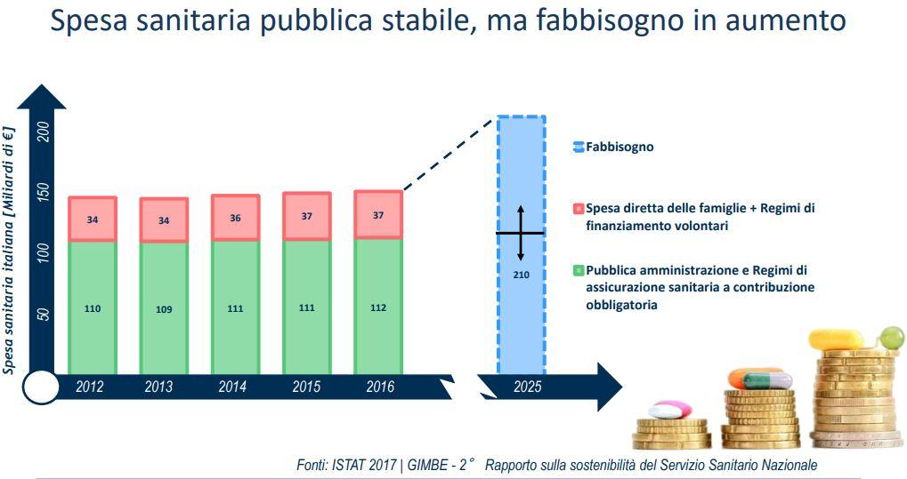

.. _h2f172e3768552216c5625562123366:

4. Politiche verticali per la sostenibilità
###########################################

.. _h2c1d74277104e41780968148427e:

.. _h7072627f221a1d27432953769781c52:

4.1 Sanità
**********

La sostenibilità del nostro Sistema Sanitario e, soprattutto, il suo carattere universalistico sono messe alla prova dalla divaricazione tra risorse disponibili e bisogni dei cittadini. 
Nei prossimi anni l’invecchiamento demografico e l’aumento della speranza di vita faranno lievitare la domanda di assistenza e cura: con il 21,8% dei cittadini over 65 e il 6,5% over 80, l’Italia è il Paese più vecchio in Europa, e si posiziona al secondo posto nel mondo, preceduto solo dal Giappone. La bassa natalità è destinata a peggiorare la situazione: si prevede che nel 2050 gli anziani sopra i 65 anni saranno il 34,6% della popolazione, mentre gli ultraottantenni raggiungeranno quota 14,9%. A ciò si aggiunge che l’aspettativa di vita in buona salute all’età di 65 anni in Italia è tra le più basse nei paesi OCSE, con 7,5 anni senza disabilità per le donne e circa 7,8 anni per gli uomini. 

\ |IMG1|\ 

A fronte di questo la spesa sanitaria pubblica, negli ultimi anni, è stata praticamente stabile, ma è cresciuta la componente a carico delle famiglie: nel 2016 in Italia sono stati spesi circa 150 miliardi di euro per la Sanità, di cui circa 112 a carico del Sistema Sanitario Nazionale e 37 di “out of pocket” e a carico di assicurazione private. Si tratta di una cifra complessiva apparentemente enorme, ma in realtà moderata se rapportata al PIL e confrontata con altri Paesi europei: infatti, rappresenta “appena” l’8,9% del reddito nazionale, una percentuale decisamente inferiore a quella di altri Paesi come Germania (11,3%), Francia (11%) e Regno unito (9,7%). Occorre, inoltre, sottolineare che tale spesa è stata pressoché stabile negli ultimi anni (nel 2012 la spesa complessiva era di 144,5 miliardi, di cui 34 privata) ma che la spesa out of pocket ha aumentato la sua incidenza sul totale. Se, come risulta da stime recenti, la spesa sanitaria nazionale dovesse salire nel 2025 a 210 miliardi di euro, una larga parte degli ulteriori 60 miliardi necessari a coprire tale fabbisogno potrebbe essere a carico delle famiglie: molte di esse, anche nel cosiddetto ceto medio, si troverebbero nella sostanziale impossibilità di accedere alle cure, producendo fenomeni preoccupanti di disuguaglianza e degrado sociale. I dati Eurostat relativi al 2016 mostrano, infatti, come oltre il 20% della popolazione abbia avuto difficoltà elevata o moderata nel permettersi le cure.

\ |IMG2|\ 

L’equilibrio necessario non potrà essere raggiunto penalizzando la qualità dei servizi sanitari.  Invece, secondo l’ultimo rapporto Euro Health Consumer Index, l’Italia è passata, tra il 2010 e il 2017, dal 14° al 22° posto delle 35 nazioni censite a livello europeo per performance del sistema sanitario: siamo tra i peggiori Paesi per accessibilità ai servizi e tempi di attesa, gestione dei pazienti anziani sul territorio e possibilità di offrire cure di nuova generazione. 
In questa situazione di forte divario tra risorse disponibili e bisogni crescenti della popolazione l’unica risposta è l’innovazione indirizzata a:

#. Rinnovamento organizzativo e tecnologico.

#. Empowerment del cittadino paziente.

#. Competenze degli operatori sanitari.

#. Capacità di gestione e interazione con i soggetti del mercato dei beni e servizi per la sanità.

\ |STYLE0|\ 

Occorre:

* Riorganizzare, basandosi anche sugli strumenti digitali disponibili, l’integrazione delle AO e AOU con le iniziative socio-assistenziali.

* Potenziare le equipe territoriali e il ruolo dell’infermiere di territorio.

* Riorganizzare la rete della medicina di prossimità, promuovendo l’integrazione e la collaborazione dei MMG e dei PLS con le ASL, AO e AOU (sviluppo e diffusione di strumenti di condivisione delle informazioni come Cartella Clinica Elettronica, FSE).

* Costruire un modello di presa in carico in cui l'azienda sanitaria svolga un ruolo di regia e integrazione tra gli attori che operano con il cittadino, utilizzando le tecnologie per il telemonitoraggio, la telemedicina, la teleassistenza. 

* Mettere in rete i care-giver, anche informali (badanti) e curarne la formazione.

* Consolidare la collaborazione orizzontale tra ASL. AO, AOU ripensando in digitale i processi attuali e condividendo saperi e esperienze (repository condivisi di progetti, soluzioni…).

\ |STYLE1|\ 

Il patrimonio di dati preziosissimi destinati a crescere per mole e rilevanza rischia a causa della digitalizzazione ancora parziale e disomogenea del nostro SSN di rilevarsi nei fatti non disponibile o inutilizzabile. In questo modo si penalizza l’appropriatezza terapeutica e si agisce con ritardo e poca incisività su sprechi e possibili abusi. I dati ci servono per migliorare le performance ed il modello di funzionamento degli Enti del SSN. 
Occorre:

* Stabilire processi e policy di Data Governance per avere dati di qualità ed efficienza nella loro gestione.

* Creare un mix di competenze, favorendo la cooperazione strutturata di data scientist con i leader del cambiamento, i process owner e gli esperti di dominio.

\ |STYLE2|\ 

Il cittadino deve essere sempre più al centro del Sistema Sanitario, attivo e partecipe nella corretta gestione della propria salute. Anche in questo ambito il digitale può giocare un ruolo fondamentale.

Riguardo l’accesso ai servizi:

* Attuare un approccio multicanale, tradizionale e digitale (incrementare la diffusione di SPID, attraverso la consegna di credenziali presso le strutture di cura o indagine diagnostica);

* Semplificare l’accesso reso difficile da interpretazione rigida e formale della protezione dei dati personali;  

* Adottare tecnologie (es. app) il più possibile simili a quelle d’uso comune;

* Accelerare il processo di diffusione del FSE (con PDTA integrati).

Riguardo la comunicazione:

* Spostare la comunicazione circa i servizi offerti e la prevenzione dai siti internet degli Enti agli strumenti che i cittadini ritengono propri (Social network);

* Profilazione degli assistiti (cfr. raccomandazione dati) per personalizzare l'informazione, la comunicazione, i canali.

\ |STYLE3|\ 

La spesa digitale in Sanità è frammentata e cresce con lentezza.  Le complicazioni introdotte dalle norme sulla trasparenza; dal nuovo codice degli appalti; a volte, la scarsa conoscenza di strumenti di acquisto innovativi (Procedure competitive con negoziazione, Nuovo dialogo competitivo, Partenariato per l’innovazione) da parte delle funzioni aziendali responsabili ha prodotto una burocrazia difensiva che, di fronte a troppe norme non definite, si astiene dal prendere decisioni che possano comportare rischi. Tali vincoli normativi sono incompatibili con chi deve erogare servizi sanitari e con il mandato delle Direzioni Aziendali.

* Diffondere l’uso intelligentemente delle convenzioni Consip: SGI e SPC

* Far precedere le Gare Consip da una fase di analisi dei fabbisogni contestualizzata sui processi standardizzabili in modo da creare le condizioni per un utilizzo uniforme/focalizzato delle convenzioni. 

* Creare catalogo delle soluzioni e Certificazione soluzioni (Ministero della Salute, AGID, FIASO, FederSanità, Agenas, ASSINTER, UniIndustria, Confindustria Digitale…).

* Realizzare un Osservatorio nazionale dei prezzi.

* Sviluppare competenze all’interno delle Centrali acquisti (ma anche all’interno di Regioni, ASL, AO, AOU) e favorire l’integrazione tra le figure preposte nelle Organizzazioni all’innovazione con la funzione acquisti.

* Redigere manuali operativi per indicare come si utilizzano gli strumenti di procurement innovativo (sottoporre proposta ad ANAC e Corte dei Conti).

|

.. _h537236e402f2e20263b59351a391740:

4.2 Lavoro e occupazione
************************

I dati ISTAT mostrano che un tasso di occupazione al 58%, il livello più alto dal 2009, pur "rimanendo 0,7 punti al di sotto del picco del 2008", il valore massimo pre-crisi. Lo stesso discorso vale per il numero di occupati, che sono risultati 23 milioni e 23 mila (con una crescita dell'1,2%, ovvero 265 mila persone in più al lavoro). L'aumento della presenza al lavoro "per il secondo anno consecutivo coinvolge anche i giovani di 15-34 anni, fascia di età in cui gli occupati sono saliti di 45mila unità (+0,9%). \ |STYLE4|\ : Nord, Centro e Sud mostrano infatti tutti un'occupazione in recupero, tuttavia mentre nel Centro-Nord il tasso di occupazione raggiunge livelli pressoché analoghi a quelli del 2008, arrivando al 66,7% nel Nord e 62,8% nel Centro, nel Mezzogiorno l'indicatore è ancora al di sotto del 2008 di 2,0 punti (44,0%). Il tasso di disoccupazione è sceso nel 2017 di 0,5 punti percentuali, dall'11,7% all'11,2% dell'anno precedente: si tratta del livello più basso dal 2013. Calano anche gli inattivi (coloro che non cercano né hanno occupazione). La discesa della disoccupazione "è più forte per i più giovani in confronto ai 35-49enni mentre per gli ultra 50enni aumenta sia il numero di disoccupati sia il tasso di disoccupazione".

|

.. _h6f18b668701d1e14511e767856665d:

Occupazione giovanile
=====================

Secondo Eurostat, nel 2017 i NEET italiani (\ |STYLE5|\ ) sono il 25,7%, dieci punti sopra la media europea che è pari al 14,3%. Emergono differenze tra le diverse aree del Paese: secondo ISTAT, infatti, i NEET sono il 17% al Nord, il 20,4% al Centro e il 34,2% nel Mezzogiorno. \ |STYLE6|\ . Oggi l’incidenza dei NEET è simile sia per i giovani con licenza media (22,7%) sia per quelli con diploma o laurea (22,9%), mentre è significativamente superiore per chi ha un diploma di scuola superiore (26,1%).

L’ANPAL ha provveduto a istituire il nuovo “Incentivo Occupazione Giovani” per promuovere l’occupazione dei NEET di età compresa tra i 16 e i 29 anni che hanno aderito al programma. Si tratta di una misura rivolta ai datori di lavoro che effettuino assunzioni di giovani da gennaio 2017 a dicembre 2018, con contratto a tempo indeterminato (anche \ |STYLE7|\ ), contratto di apprendistato professionalizzante o contratto a tempo determinato della durata di almeno 6 mesi. Le risorse stanziate ammontano a circa 200 milioni di euro e sono indirizzate a tutto il territorio nazionale, ad eccezione della Provincia Autonoma di Bolzano. A fine giugno 2017 le domande presentate erano state quasi 50.000, di cui oltre il 60% sono state confermate.

Con il Decreto 21 novembre 2016, il Ministero del Lavoro e delle Politiche Sociali ha previsto un conguaglio contributivo per i datori di lavoro che, nel corso del 2017, senza esservi tenuti, assumano giovani di età compresa tra i 15 e i 24 anni, o alternativamente soggetti di età superiore ai 25 anni privi d'impiego regolarmente retribuito da almeno 6 mesi. La sede di lavoro deve essere localizzata in una delle regioni del Sud e il rapporto di lavoro deve necessariamente essere instaurato attraverso un contratto a tempo indeterminato o di apprendistato professionalizzante.

|

.. _h30466d3fa51716603e3e2b5a24c:

Alternanza scuola-lavoro
========================

Al fine di “incrementare l’alternanza scuola-lavoro nel secondo ciclo di istruzione”, così come sancito all’art. 1 comma 7 lettera o) della legge 107/2015, e di promuovere l’occupazione dei giovani in procinto di uscire dal circuito formativo, la legge di bilancio 2016 ha previsto misure di sostegno all’occupazione per i soggetti che abbiano partecipato ai programmi di alternanza scuola-lavoro o svolto un periodo di apprendistato. Si prevede l’esonero dal versamento dei contributi previdenziali (per un periodo massimo di tre anni e nel limite di 3.250 euro all’anno per ciascun lavoratore) per i datori di lavoro che tra l’inizio del 2017 e la fine del 2018 procedano all’assunzione con contratto a tempo indeterminato, entro 6 mesi dall’acquisizione per titolo di studio, di numerose categorie di giovani.

|

.. _h6d4665a325a1f6593912d43613d54:

Industria 4.0
=============

Un passo in avanti per favorire l’ammodernamento del sistema produttivo e garantire significativi aumenti di produttività e competitività soprattutto al comparto industriale anche attraverso la digitalizzazione della filiera grazie all’utilizzo delle nuove tecnologie. Approvato in via definitiva con la Legge di Bilancio per il 2017, il Piano prevede: super/iper ammortamento per nuovi investimenti innovativi, il credito d’imposta sugli investimenti in R&S e della nuova Sabatini, che si uniscono alle misure per le start-up e le PMI innovative e al rafforzamento del Fondo Centrale di Garanzia. Il Governo ha stanziato risorse per circa 13 miliardi di euro nel periodo 2017-2024 e stima che solo nel 2017 tali misure possano mobilitare nuovi investimenti privati per circa 10 miliardi di euro.

|

.. _h385c12e21d148235e633736645a4:

4.3 Città e territori
*********************

Con l’approvazione della \ |LINK1|\  presentata al Consiglio dei Ministri il 2 ottobre 2017 e approvata dal CIPE il 22 dicembre 2017, le politiche urbane sono tarate in chiave di innovazione e sostenibilità. L’\ |LINK2|\  proposta da ASviS, Urban@it e ANCI collega i 17 SDGs alle attività delle amministrazioni locali e di governo. Il documento contiene gli obiettivi che le aree urbane devono raggiungere per attuare la Strategia Nazionale e le politiche necessarie, che dovranno diventare parte integrante dell’Agenda urbana nazionale. Al tema della sostenibilità si collega, quindi, la \ |STYLE8|\ .

Sul tema delle risorse a disposizione delle città e del territorio, fa fede il \ |STYLE9|\  cui afferiscono 892,9 milioni di euro della politica di coesione, e il cosiddetto \ |STYLE10|\  pubblicato nel maggio del 2016. Tra i soggetti beneficiari del bando, oltre ai comuni capoluogo, anche le Città metropolitane, enti di recente istituzione e quindi chiamate per la prima volta ad agire nelle politiche di rigenerazione urbana, intesa come politica di area vasta. L'intervento arriva a mobilitare quasi 4 miliardi di euro complessivi. A questo si aggiungono i 16 Patti per il Sud: uno per ognuna delle 8 Regioni (Abruzzo, Molise, Campania, Basilicata, Puglia, Calabria, Sicilia, Sardegna), uno per ognuna delle 7 Città Metropolitane (Napoli, Bari, Reggio Calabria, Messina, Catania, Palermo, Cagliari) e il Contratto Istituzionale di Sviluppo (CIS) di Taranto. I Patti declinano concretamente gli interventi che costituiscono l’asse portante del Masterplan per il Mezzogiorno.

|

.. _he3f663b217b472a24111e1d6e16859:

Coordinamento centro-periferia 
===============================

Un passaggio necessario è quello di ripensare l’agenda delle priorità della politica pubblica nazionale, dedicando più attenzione al territorio, alle città, ai comuni e alle forme di collaborazione civica e pubblica. In particolare, è necessario che si sostengano i comuni sul piano della programmazione, della progettazione degli interventi e della previsione di politiche ideali di cambiamento, con particolare attenzione alle aree più degradate e alle periferie. 

.. admonition:: Raccomandazione 4.3a - Adottare un’Agenda urbana nazionale che assuma la forma di un patto tra amministrazione centrale e autorità urbane

    L’Agenda urbana nazionale dovrebbe: essere uno strumento concreto attraverso il quale perseguire obiettivi di grande impatto e interesse pubblico e avere al centro i temi della sostenibilità come proposto dall’“\ |LINK3|\ ” elaborata da ASviS, Urban@it e ad ANCI, che individua gli obiettivi che le aree urbane devono raggiungere per attuare la \ |LINK4|\  e le politiche necessarie.

.. admonition:: Raccomandazione 4.3b - Individuare un punto di riferimento all’interno dell’amministrazione centrale che abbia il compito di coordinare le politiche per le città e di definire l’Agenda urbana nazionale

    Quest’ultimo punto fa parte dei \ |LINK5|\  che sono stati \ |LINK6|\  del Paese.

.. admonition:: Raccomandazione 4.3c - Recuperare e sviluppare l’esperienza del Bando periferie

    Bisogna rendere stabili misure di finanziamento che, ad oggi, sono state straordinarie, andando verso un programma ordinario per le zone maggiormente vulnerabili delle città: un “Piano strategico per le città italiane” di carattere pluriennale. Si deve superare la logica dei bandi, prevedendo un meccanismo di finanziamento continuativo, premessa indispensabile per dare continuità al lavoro di progettualità delle città.

.. admonition:: Raccomandazione 4.3d - Costituire una Commissione bicamerale per le città e le periferie, come proposto dalla Commissione d’inchiesta parlamentare sulla condizione delle periferie urbane

    L’obiettivo è passare dalla straordinarietà della Commissione d’inchiesta all’ordinarietà di una Commissione che diventi il luogo dove si esaminano provvedimenti, si acquisiscono pareri, si sviluppano proposte. È un po’ il ruolo che ha la Commissione bicamerale per le questioni regionali, quindi si tratterebbe di affiancare a questo strumento già esistente uno strumento nuovo sul tema delle città e delle periferie.

.. admonition:: Raccomandazione 4.3e - Realizzare una Strategia per le aree urbane

    Riprendere la logica della \ |LINK7|\  avviata nel settembre 2012 dall’allora Ministro per la Coesione Territoriale Fabrizio Barca con il supporto di un Comitato Tecnico Aree Interne costituito allo scopo. Obiettivo della Strategia: garantire l'accessibilità a servizi essenziali, quali istruzione, mobilità e sanità, nei territori interni rurali e prevede per ciascuna area-progetto una strategia di sviluppo con una serie di interventi da attuare attraverso un Accordo di Programma Quadro (APQ). Gli interventi previsti dall'APQ sono finanziati a valere sui Fondi europei e sulle risorse stanziate dalla legge di Stabilità.

.. admonition:: Raccomandazione 4.3f - Dare seguito al PON Metro, realizzando i progetti approvati

    Mettere in campo tutte le risorse possibili per mantenere gli impegni che le città hanno assunto nei confronti del governo e dell’Europa, quindi usare le misure complementari e i piani di rafforzamento amministrativo per dare sostegno alle città nella spesa, nel dare attuazione ai progetti presentati e approvati.

|

.. _h363438484644623742c5a16533b4570:

Poteri locali e associazionismo comunale
========================================

La \ |LINK8|\  ha prorogato ancora una volta (fino al 31 dicembre 2018) i termini entro i quali i comuni con popolazione inferiore ai 5 mila abitanti (fino a 3 mila se appartenenti a comunità montane) avrebbero dovuto avviare l’esercizio obbligato in forma associata delle funzioni fondamentali, mediante unione o convenzione (come previsto dal decreto legge 78/2010). Questo carattere di obbligatorietà finora non ha dato frutti. In caso di inadempienza il decreto prevedeva l’avvio di una procedura sanzionatoria che avrebbe dovuto portare al commissariamento. Finora però, invece che sulle sanzioni, la scelta è caduta sulla ripetuta proroga dei termini previsti dalla legge. La situazione dell’associazionismo comunale è quindi ancora caotica e disomogenea come del resto il quadro di riferimento dei poteri locali in Italia, nonostante i tentativi di riordino, come quello della \ |LINK9|\ . 

.. admonition:: Raccomandazione 4.3g - Attuare la riforma Delrio, lavorare a un riordino e a una riforma organica dei poteri locali

    E’ necessario il completamento sul piano costituzionale della riforma Delrio con la riforma delle Province, definizione delle funzioni fondamentali delle Città metropolitane e definizione di un quadro certo di finanza all’interno del quale si possano esercitare queste funzioni. A questo, va aggiunta l’introduzione di una disciplina legislativa statale rispettosa dell’autonomia delle regioni, volta a riordinare le province come enti di area vasta e a regolare i relativi rapporti con le regioni e i comuni in maniera larga ma uniforme nel territorio nazionale.

.. admonition:: Raccomandazione 4.3h - Rilanciare l’associazionismo comunale come strumento di governo del territorio e occasione di riforma delle istituzioni

    Abrogare l’obbligo a carico dei comuni di esercitare in forma associata le funzioni fondamentali. Adottare politiche differenziate, di semplificazione e di sostegno dei comuni che si associano, tenendo conto delle diverse caratteristiche territoriali, economiche e sociali. Privilegiare le Unioni dei comuni e le fusioni, considerando le prime come un necessario passaggio verso le seconde che costituiscono un obiettivo primario. Favorire la volontarietà dell’associazionismo con un processo di coinvolgimento da condurre insieme con le regioni e le nuove province. Superare i limiti demografici per la costituzione di gestioni associate e individuare ambiti omogenei di natura economica e sociale, mantenendo come prevalente il criterio della contiguità territoriale; introdurre robusti meccanismi incentivanti (finanziari ma non solo) in modo da creare situazioni attrattive di effettiva convenienza.

|

.. _he4566252165161c157d3e4d222b7f:

Piattaforme e servizi per la smart city
=======================================

Con il procedere della implementazione delle infrastrutture di comunicazione (banda larga e ultralarga, wifi pubblici, etc.), lo sviluppo tecnologico dei sensori (in grado di raccogliere e trasmettere informazioni), la definizione di modelli sempre più sofisticati e conseguenti applicazioni in grado di trattare quantità enormi di dati, va aprendosi una nuova fase nel percorso di digitalizzazione delle città. Le reti funzionali (energia, gas, acqua, trasporti pubblici, illuminazione pubblica) sono in condizione di divenire sempre più “intelligenti” e quindi più efficaci ed efficienti; l’ecosistema urbano può essere sempre più monitorato in tutti i suoi aspetti (produzione e raccolta di rifiuti, qualità dell’aria, sicurezza, traffico, condizione degli edifici e delle infrastrutture); le interazioni sociali (lavoro, consumi, accesso ai servizi, relazioni sociali, partecipazione civile) possono moltiplicarsi e raffinarsi. Si aprono nuove opportunità ma anche nuove criticità sui fronti dell’accesso e dell’utilizzo di queste informazioni sia in forma aggregata sia, potenzialmente, in forma singolare e individuabile.

.. admonition:: Raccomandazione 4.3i - Attuare una revisione delle regole di acquisizione dei servizi tecnologici-digitali

    Tale raccomandazione vale sia in termini di procedure per il loro acquisto sul mercato sia in termini di modalità di definizione delle partnership pubblico-privato che appaiono cruciali in questi ambiti e che non appaiono regolate in modo efficace dalle attuali normative sugli appalti di servizi. Naturalmente esiste anche un problema di risorse dedicate, quantomeno in termini di deroga ai vincoli di spesa per gli investimenti effettuati in questo ambito, finanziati con i risparmi realizzati.

.. admonition:: Raccomandazione 4.3i - Attuare una revisione delle regole di acquisizione dei servizi tecnologici-digitali

    Tale raccomandazione vale sia in termini di procedure per il loro acquisto sul mercato sia in termini di modalità di definizione delle partnership pubblico-privato che appaiono cruciali in questi ambiti e che non appaiono regolate in modo efficace dalle attuali normative sugli appalti di servizi. Naturalmente esiste anche un problema di risorse dedicate, quantomeno in termini di deroga ai vincoli di spesa per gli investimenti effettuati in questo ambito, finanziati con i risparmi realizzati.

.. admonition:: Raccomandazione 4.3l - Approfondire la questione dell’acquisizione e dell’utilizzo delle informazioni

    Anche questo aspetto sembra richiedere un approfondimento della regolazione, principalmente, ma non esclusivamente, relativamente alle problematiche della privacy.

.. admonition:: Raccomandazione 4.3m - Creare un luogo di regia/consultazione a livello centrale cui le amministrazioni locali possano riferirsi per avere supporto nelle loro scelte e nei loro impegni

    Questo può tradursi nella elaborazione, possibilmente partecipata, di linea guida nazionali e di sedi di interscambio delle esperienze. Un processo di trasformazione delle reti urbane di questa portata e di questa complessità deve fondarsi sull’iniziativa locale, sulla capacità delle singole amministrazioni di individuare necessità e priorità, ma va inserito in un quadro generale che dia la direzione di marcia e supporti tecnicamente e metodologicamente l’azione locale.

|

.. _h7d77441b36154752a41756f66747b78:

4.4 Energia e ambiente
**********************

Negli ultimi anni è aumentato il livello di priorità attribuito alle politiche ambientali, si rilevano diverse iniziative intraprese a livello globale e nazionale per favorire politiche territoriali e inglobare azioni di mitigazione e di adattamento ai cambiamenti climatici nella pianificazione. Nel corso degli ultimi due anni, in Italia, sono state messe in campo una serie di iniziative che traducono in atti concreti l’Accordo di Parigi sui
cambiamenti climatici, sottoscritto da 175 Paesi ed entrato in vigore il 4 novembre del 2016. 

La priorità per il futuro è quindi l’attuazione dell’Accordo di Parigi nell’ambito del quadro sovraordinato della Strategia Nazionale per lo Sviluppo Sostenibile (SNSvS). A livello europeo, molte sono state le novità intercorse nell’ultimo anno. Il 18 aprile scorso  è stato approvato dal Parlamento Europeo il pacchetto legislativo sull’Economia Circolare. La normativa è stata pubblicata nella Gazzetta Ufficiale e dovrà essere recepita dagli Stati membri nei propri ordinamenti, entro il 5 luglio 2020.

|

.. _h3f1c512d481f17303468601813187d17:

Strategia Nazionale Energetica (SEN)
====================================

\ |STYLE11|\ . 175 miliardi di investimenti per costruire un sistema più competitivo, garantendo non solo energia a minor costo per cittadini e imprese ma anche lo sviluppo di nuovi mercati e nuova occupazione; più sostenibile attraverso l’efficienza nei consumi, il risparmio energetico e la mobilità elettrica; più sicuro migliorando la sicurezza delle infrastrutture e la flessibilità dell’offerta.

La Strategia, coerentemente con gli obiettivi ambiziosi e complessi che si prefigge, assume valore non soltanto per i contenuti che esprime ma anche per il modello partecipativo adottato, essendo il frutto di un percorso partecipato a cui hanno contribuito regioni, EELL e oltre 250 tra associazioni, imprese e mondo della ricerca.

.. admonition:: Raccomandazione 4.4a - Applicare il modello partecipativo, sperimentato con la SEN, anche alle fasi successive che andranno sviluppate

    Tale modello permette di rafforzare la collaborazione tra istituzioni ed aziende e la coerenza delle azioni nel medio-lungo termine, condizioni necessarie per consolidare e portare avanti la Strategia nella prossima legislatura. Non bastano tuttavia PA e imprese, il terzo soggetto da coinvolgere sono i cittadini che avranno un ruolo sempre più rilevante nel raggiungimento degli obiettivi grazie al risparmio energetico ed al mutamento delle abitudini di consumo da parte delle famiglie e delle comunità locali.

.. admonition:: Raccomandazione 4.4b - Conferire forza al ruolo dell’Autorità di regolazione per energia, reti e ambiente

    È opportuno riconoscere e rilanciare il compito dell’Autorità sia di creare un ambiente di mercato in cui l’informazione sia accessibile e trasparente a tutti i soggetti, sia di determinare indirizzi, strumenti efficaci e regole di attuazione della Strategia. Tale funzione è ben distinta dalla funzione di policy making dello Stato rappresentata da Governo e Parlamento.

.. admonition:: Raccomandazione 4.4c - Mantenere forte il focus sulla sostenibilità ambientale della Strategia energetica

    Occorre mantenere viva l’attenzione al tema della sostenibilità ambientale, da un lato inserendola in una visione più ampia di sviluppo del Paese legato alla Green economy, dall’altro valutando attentamente l’impatto ambientale delle azioni messe campo su consumo di suolo, qualità dell’aria e delle acque, etc. Sul tema del consumo di suolo, ad esempio, è necessario dotarsi di piani urbanistici coerenti e di una politica di recupero e bonifica dei siti di interesse nazionale che riducano l’occupazione di suolo agricolo.

.. admonition:: Raccomandazione 4.4d - Prestare maggiore attenzione e coinvolgimento degli EELL

    Per garantire una ricaduta efficace delle diverse misure è necessario prestare maggiore attenzione al coinvolgimento degli enti locali. Le amministrazioni locali sono soggetti che contribuiscono in maniera rilevante, positivamente o negativamente, al raggiungimento degli obiettivi. Ambiti come la mobilità e l’efficienza energetica, l’illuminazione pubblica, la riqualificazione di edifici pubblici rientrano a pieno titolo tra le funzioni dei comuni i quali devono certamente veder potenziati gli strumenti a disposizione, sia in termini di incentivi sia in termini di crescita delle capacità e competenze amministrative in ambito energetico.

.. admonition:: Raccomandazione 4.4e - Integrare la SEN nel quadro delle strategie europee

    Oggi una politica energetica attuata in Italia ha riflessi attivi e passivi sugli altri Paesi, importando ed esportando effetti rispetto alle altre strategie europee.

|

.. _h4b5e1465d7f177845f1570254d5c42:

Economia circolare
==================

L'economia circolare segna il passaggio da un modello lineare di produzione a un modello circolare e consiste nell'assunzione di tre semplici assiomi: riciclare (scarti non riutilizzabili), ridurre (sprechi di materie prime) riutilizzare (estendendo il ciclo di vita dei prodotti). In un’economia circolare i flussi di materiali sono di due tipi: quelli biologici, in grado di essere reintegrati nella biosfera, e quelli tecnici, destinati ad essere rivalorizzati senza entrare nella biosfera. Per realizzarla serve rispettare tre principi:

* Riscoprire i giacimenti di materia scartata come fonte di materia prima: raccolta dei rifiuti, riciclo, riutilizzo, gestione degli output produttivi, scarti agricoli (bioeconomia);

* Fine dello spreco d’uso del prodotto (\ |STYLE12|\ ), prima ancora di essere scartato. Favorire condivisione e uso collettivo, con l’introduzione di prodotti di business;

* Fermare la morte prematura della materia. Allungamento tempi di vita del prodotto, facilità di riparazione, upgrading, sostituzione, \ |STYLE13|\ , ecc., sono alcune delle strategie necessarie da adottare per ritardare il più possibile la rigenerazione/riciclo della materia.

Un ampio slancio a questa economia è dato dal ruolo svolto dalla PA nell’adozione di atti autoritativi, nelle attività di programmazione, negli impegni di regolazione del mercato delle imprese, nel creare nuove opportunità e pratiche di condivisione. 

\ |STYLE14|\ . Questo obbligo si incardina in un contesto di normativa di derivazione comunitaria, di atti di indirizzo comunitari, di comunicazioni della Commissione Europea sull’economia circolare - COM (2014) 398 e COM (2015) 614 - e sull’uso efficiente delle risorse - COM (2011) 21 e COM (2011) 571, di accordi internazionali, come l’Accordo sul clima di Parigi, che impongono l’adozione di tutte le misure efficaci per promuovere modelli di economia circolare, l’efficienza nell’uso delle risorse e dell’energia, il minor impiego e dispersione di sostanze chimiche pericolose.

Dopo tre anni di trattative, il Parlamento europeo riunito in plenaria a Strasburgo lo scorso aprile, ha dato il via libera al cosiddetto “Pacchetto sull’Economia Circolare”, costituito da quattro direttive sui \ |LINK10|\ , sulle \ |LINK11|\ , sugli \ |LINK12|\  e sui \ |LINK13|\ , pensato per combinare ambientalismo e crescita economica.

.. admonition:: Raccomandazione 4.4f - Recepire con rapidità le Direttive ed anticipare strategie importanti come eco-design, strategia sulla plastica, rafforzamento della responsabilità estesa di prodotto

    Per il nostro Paese il recepimento delle Direttive europee comporterà un profondo rinnovamento della normativa sui rifiuti, lo sviluppo di strumenti di eco-design e dei mercati di materie prime e seconde, la cooperazione tra regioni sul riciclo e sull’ottimizzazione dei rifiuti, permetterà che qualsiasi persona fisica o giuridica che sviluppi, fabbrichi, trasformi, venda o importi prodotti sia soggetto ad una responsabilità estesa del produttore.

.. admonition:: Raccomandazione 4.4g - Mappare l’esistente

    l’Italia oggi offre numerose esperienze di economia circolare. Per una migliore comprensione dell’estensione del fenomeno e una migliore programmazione economica serve mappare con attenzione questi flussi.

.. admonition:: Raccomandazione 4.4h - Definire i criteri per il passaporto dei materiali

    Riconoscere i materiali di cui un oggetto è composto diviene fondamentale per gestire il suo fine vita, aumentando la tracciabilità dei flussi, anche impiegando blockchain, combattendo così l’illegalità.

.. admonition:: Raccomandazione 4.4i - Creare uno standard CE

    Quando si realizzano gare d’appalto è essenziale esplicitare i requisiti CE, formando però allo stesso tempo le aziende attraverso i processi di innovazione. Serve impiegare le certificazioni ambientali e sociali esistenti. Se si analizza la conformità ai CAMi delle aziende rispondenti ai bandi della PA, in particolare in relazione al CAM edilizia 2017, notiamo come l’adesione totale a questi obiettivi si riscontra solamente nel 6% dei partecipanti.
    Occorre investire in ricerca e sviluppo, sia presso le università che gli appositi centri (pubblici e privati); sostenere progetti di studio, ricerca e comunicazione per approfondire gli innumerevoli temi dell’economia circolare; sostenere gli incubatori della CE.

|

.. _h414b1e7073564b1c6019276d75343944:

4.5 Istruzione e formazione
***************************

[...]

.. bottom of content

.. |STYLE0| replace:: **Spostare le cure dall’ospedale al territorio e definire processi di presa in carico dei sempre più numerosi pazienti cronici.**

.. |STYLE1| replace:: **Realizzare applicazioni per valorizzare il flusso di informazioni che il SSN produce quotidianamente**

.. |STYLE2| replace:: **Costruire rapporto di fiducia tra cittadini e Enti della sanità**

.. |STYLE3| replace:: **Semplificare il procurement dell’innovazione digitale**

.. |STYLE4| replace:: **Aumentano soprattutto i posti di lavoro a tempo determinato e sono ancora grandi le distanze tra le aree del Paese**

.. |STYLE5| replace:: *Not in education, employment or training*

.. |STYLE6| replace:: **La crisi ha profondamente cambiato anche l’incidenza dei NEET con riferimento al livello di istruzione: se, infatti, nel 2008 questi erano maggiormente diffusi fra i giovani con solo la licenza media, negli anni della crisi la crescita ha riguardato principalmente giovani con medio e alto titolo di studio**

.. |STYLE7| replace:: *part-time*

.. |STYLE8| replace:: **riflessione sulla definizione di un’Agenda urbana come strumento di perseguimento degli obiettivi di grande impatto e interesse pubblico**

.. |STYLE9| replace:: **PON “Città metropolitane 2014 – 2020”**

.. |STYLE10| replace:: **Bando periferie, il “Bando per il programma straordinario di intervento per la riqualificazione urbana e la sicurezza delle periferie delle città metropolitane e dei comuni capoluogo di provincia”**

.. |STYLE11| replace:: **La Strategia Energetica Nazionale rappresenta per l’Italia una decisa spinta verso la sostenibilità e, insieme al Piano Industria 4.0, uno dei grandi assi di sviluppo della politica industriale da qui al 2030**

.. |STYLE12| replace:: *unused value*

.. |STYLE13| replace:: *refilling*

.. |STYLE14| replace:: **Con D.Lgs 50/2016, il GPP è diventato obbligatorio ed è stata garantita l’applicazione dei CAM (Criteri Ambientali Minimi) nelle gare pubbliche**

.. |LINK1| raw:: html

    <a href="http://asvis.it/public/asvis/files/AgendaUrbana.pdf" target="_blank">Strategia Nazionale per lo Sviluppo Sostenibile (SNSvS)</a>

.. |LINK2| raw:: html

    <a href="http://asvis.it/public/asvis/files/AgendaUrbana.pdf" target="_blank">Agenda per lo sviluppo urbano sostenibile</a>

.. |LINK3| raw:: html

    <a href="http://asvis.it/public/asvis/files/AgendaUrbana.pdf" target="_blank">Agenda per lo sviluppo urbano sostenibile</a>

.. |LINK4| raw:: html

    <a href="http://www.minambiente.it/pagina/la-strategia-nazionale-lo-sviluppo-sostenibile" target="_blank">Strategia Nazionale per lo Sviluppo Sostenibile</a>

.. |LINK5| raw:: html

    <a href="http://asvis.it/home/46-2589/il-video-appello-di-giovanninibrper-una-legislatura-sostenibile#.WqlRNejOXcs" target="_blank">10 punti di ASviS</a>

.. |LINK6| raw:: html

    <a href="http://asvis.it/home/46-2694/ladesione-di-partiti-e-movimenti-allappello-asvis-per-una-legislatura-sostenibile#.WqlRX-jOXct" target="_blank">sottoscritti dalle principali forze politiche</a>

.. |LINK7| raw:: html

    <a href="http://www.agenziacoesione.gov.it/it/arint" target="_blank">Strategia nazionale per lo sviluppo delle “Aree interne”</a>

.. |LINK8| raw:: html

    <a href="http://def.finanze.it/DocTribFrontend/getAttoNormativoDetail.do?ACTION=getArticolo&id=%7b30A3563D-685F-4C90-A0CE-DE89F3CF78EA%7d&codiceOrdinamento=300010001120000&articolo=Articolo%201-com1120" target="_blank">legge 205/2017</a>

.. |LINK9| raw:: html

    <a href="http://www.gazzettaufficiale.it/eli/id/2014/4/7/14G00069/sg" target="_blank">legge Delrio 56/2014</a>

.. |LINK10| raw:: html

    <a href="http://data.consilium.europa.eu/doc/document/PE-11-2018-INIT/en/pdf" target="_blank">rifiuti</a>

.. |LINK11| raw:: html

    <a href="http://data.consilium.europa.eu/doc/document/PE-10-2018-INIT/en/pdf" target="_blank">discariche</a>

.. |LINK12| raw:: html

    <a href="http://data.consilium.europa.eu/doc/document/PE-12-2018-INIT/en/pdf" target="_blank">imballaggi</a>

.. |LINK13| raw:: html

    <a href="http://data.consilium.europa.eu/doc/document/PE-9-2018-INIT/en/pdf" target="_blank">veicoli fuori uso</a>

.. |IMG2| image:: static/4-politiche-sostenibilita_2.jpeg
   :height: 309 px
   :width: 582 px
