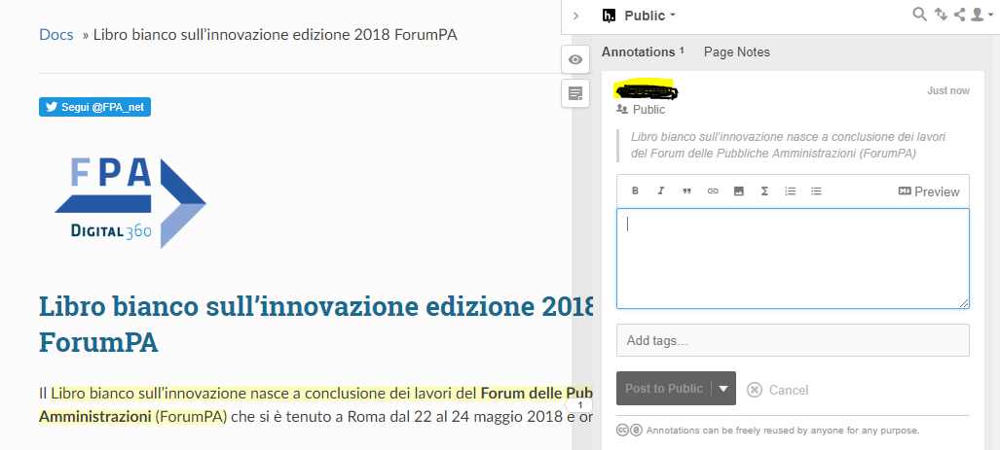

.. _h7a354522b2af3220593d396f11491d:

Partecipa alla redazione del Libro bianco
#########################################

Il Libro bianco sull'innovazione della Pubblica Amministrazione è in consultazione per un ampia condivisione. Al fine di offrire la possibilità di partecipazione è stata predisposta una modalità di interazione da parte degli utenti attraverso l'uso dello strumento \ |LINK1|\  curato dal team \ |LINK2|\ . 

In qualsiasi pagina del Libro è possibile selezionare una parola o una frase e automaticamente si aprirà una finestra in cui è possibile editare testo per il commento.

Per usare questo strumento (\ |LINK3|\ ) è necessario creare un account \ |STYLE0|\ , ma è procedura semplice che necessita di pochi secondi.

Ogni commento è pubblico e viene inserito online lateralmente al corpo del testo immediatamente dopo l'editing del commento stesso.

\ |IMG1|\ 

\ |STYLE1|\  - i commenti editati dagli utenti vengono rilasciati con \ |LINK4|\ , e possono essere riutilizzati da chiunque per qualsiasi scopo.

Alla fine del periodo di consultazione del Libro bianco tutti i commenti verranno esaminati dal Team FPA per l'integrazione nella versione finale da inviare al nuovo Governo.

\ |STYLE2|\ 

Nella tabella di seguito riportata sono elencati tutti i commenti effettuati nelle sezioni del Libro bianco in ordine temporale. La tabella si aggiorna automaticamente ad ogni commento editato dagli utenti.

|REPLACE1|

.. bottom of content

.. |STYLE0| replace:: **hypothesis**

.. |STYLE1| replace:: **Licenza**

.. |STYLE2| replace:: **Elenco dei commenti**

.. |REPLACE1| raw:: html

    <iframe width="100%" height="500px" frameBorder="0" src="https://docs.google.com/spreadsheets/d/e/2PACX-1vSWEb8M42_WhXppQr1UCIRXQ-7Cuw_xpBCCUyzr-t-mOqGbGmVCcM5Ckp5gQR7Uvqc_0K_wbqJIxrWB/pubhtml?gid=0&single=true"></iframe>

.. |LINK1| raw:: html

    <a href="https://via.hypothes.is" target="_blank">via.hypothes.is</a>

.. |LINK2| raw:: html

    <a href="https://web.hypothes.is" target="_blank">web.hypothes.is</a>

.. |LINK3| raw:: html

    <a href="https://via.hypothes.is" target="_blank">via.hypothes.is</a>

.. |LINK4| raw:: html

    <a href="http://creativecommons.org/publicdomain/zero/1.0/" target="_blank">licenza CC 0 (pubblico dominio)</a>

